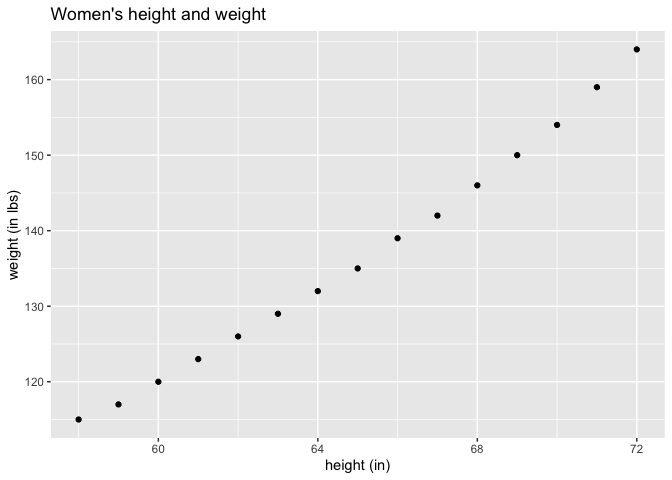

Please read, very important!
================

## GitHub Documents

This is an R Markdown format used for publishing markdown documents to
GitHub. When you click the **Knit** button all R code chunks are run and
a markdown file (.md) suitable for publishing to GitHub is generated.

## Use the following packages:

``` r
library(datasets)
library(ggplot2)
library(dplyr)
```

    ## 
    ## Attaching package: 'dplyr'

    ## The following objects are masked from 'package:stats':
    ## 
    ##     filter, lag

    ## The following objects are masked from 'package:base':
    ## 
    ##     intersect, setdiff, setequal, union

## Including Plots

### A graph a women’s height and weight

-   Trends in this graph
    -   there is a positive correlation between height and weight

*note that correlation doesn’t mean causation*

``` r
ggplot(datasets::women, aes(x = height, y = weight)) + geom_point() + labs(title = "Women's height and weight", y = "weight (in lbs)", x = "height (in)")
```

<!-- -->

Note that the `echo = FALSE` parameter was added to the code chunk to
prevent printing of the R code that generated the plot.
